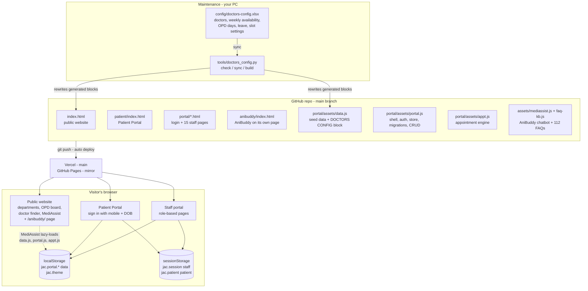
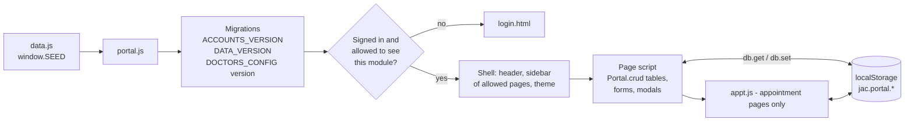
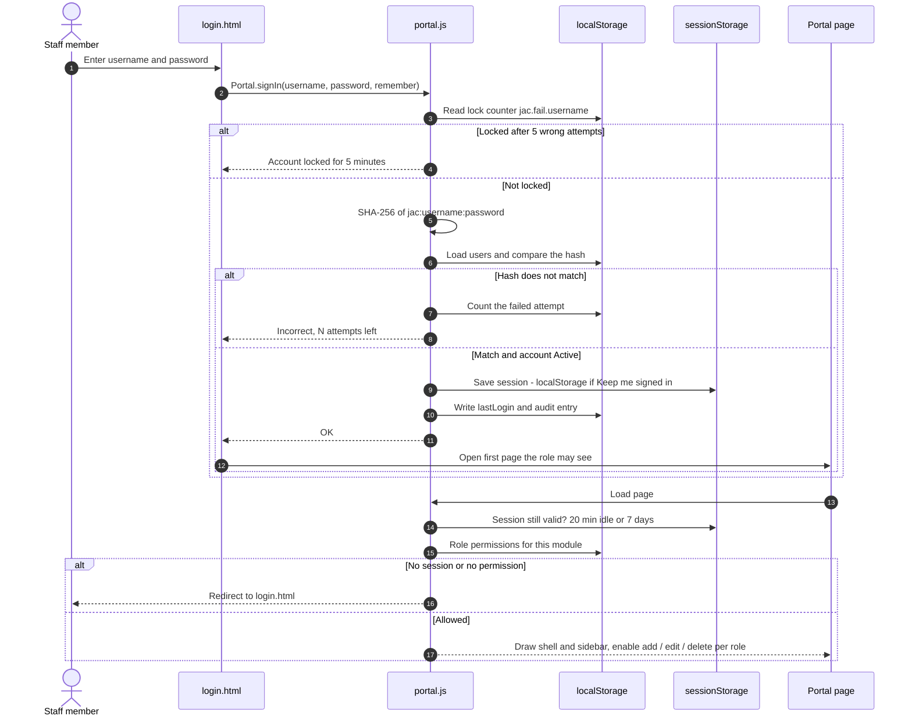
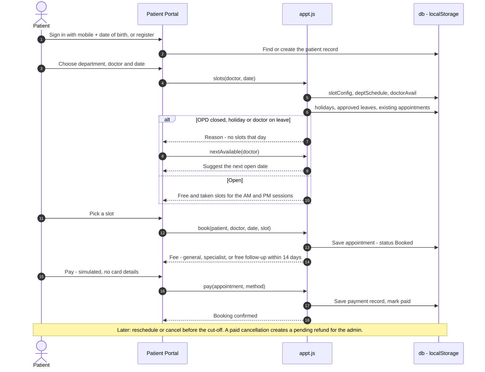
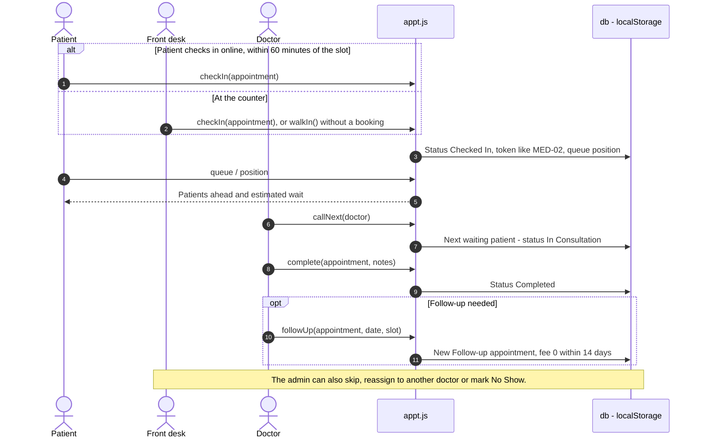
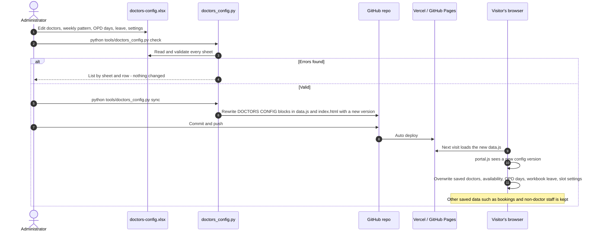
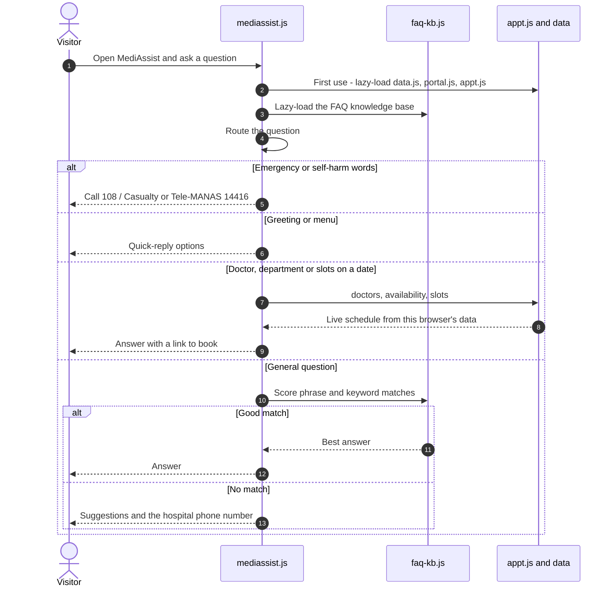

# AnI-HealthcareServices

Single-page website for a teaching hospital and medical college: OPD board, departments, doctor finder, appointment request form, programmes and admissions.

Live site (main): https://anihealthcareservices.vercel.app
Mirror (GitHub Pages): https://bharathdrive-ai.github.io/AnI-HealthcareServices/
AniBuddy chat on its own page: https://anihealthcareservices.vercel.app/anibuddy/

Both deploy automatically on every push to `main`. They don't share browser data (bookings, staff sign-ins), so share one address — the Vercel link is the main one.

All names, phone numbers, doctors and figures are placeholders.

## Staff portal

`portal/` holds a 13-page hospital administration portal (static HTML, no build step):

| # | Page | Purpose |
|---|------|---------|
| 01 | dashboard.html | Overview, appointments, patients, staff, stock alerts, KPIs |
| 02 | administration.html | Users, roles, permissions, system configuration, audit log |
| 03 | hospital-master.html | Hospital profile, departments, wards, rooms, bed board |
| 04 | appointments.html | Book by department, doctor, date and slot; status flow |
| 05 | patients.html | UHID register, demographics, history, patient journey |
| 06 | services.html | Consultation, lab, radiology, procedures, pricing, orders |
| 07 | staff.html | Doctors, nurses, employees, qualifications, employment |
| 08 | roster.html | Weekly shifts, cover counts, leave requests, availability |
| 09 | holidays.html | Hospital, department and institutional holiday calendar |
| 10 | inventory.html | Medicine master, suppliers, batches, stock, expiry |
| 11 | pharmacy.html | Prescriptions, dispensing (first-expiry-first-out), returns |
| 12 | reports.html | Operational, patient, staff and inventory reports, CSV export |
| 13 | notifications.html | SMS / email / app templates, alert rules, delivery log |

Shared code: `portal/assets/portal.css`, `portal.js` (shell, store, table component) and `data.js` (sample data).
### MediAssist (AniBuddy)

Open it from the header on the website, or use the AniBuddy page at `anibuddy/` (https://anihealthcareservices.vercel.app/anibuddy/) to share as a direct link. The ↗ button in the chat header opens that page.

"MediAssist" in the header (next to Book appointment; a chat icon on smaller screens) opens **AniBuddy**, a help assistant. Files: `assets/mediassist.js`, `assets/mediassist.css`.

- Answers from the site's own data: departments and OPD days, doctors and heads, live free slots for a doctor or department on a date ("cardiology slots tomorrow"), fees, booking/reschedule/check-in rules, holidays, visiting hours, pharmacy, blood bank, contacts, programmes and admissions.
- FAQ knowledge base: `assets/faq-kb.js` holds **112 questions in 12 categories** (appointments, fees and insurance, doctors, emergency, admission and stay, lab and scans, pharmacy, visiting and facilities, records, mother and child, students, other help). Matching uses key phrases plus distinctive-word overlap (with plurals, word stems and spelling variants), so reworded questions find the right answer. Type "help" to browse by category. Answers use sample details; edit `faq-kb.js` to replace them — each entry is one question, its phrasings and its answer.
- Understands everyday words (heart, kids, x-ray, eye) and dates (today, tomorrow, Friday, 12 Oct).
- Safety: no medical advice; emergency words show 108 and Casualty; self-harm words show 108 and Tele-MANAS (14416). Asks for and stores no personal details.
- Rule-based and runs in the browser (no API key or server). An AI-powered version would need a small server to keep the API key secret.

### Appointment management

Three areas share one appointment engine (`portal/assets/appt.js`), so a booking made anywhere shows up everywhere:

| Area | Where | What it does |
|---|---|---|
| Patient Portal | `patient/index.html` (public; linked from the website) | Sign in with mobile + date of birth or register; find a doctor, book, reschedule, cancel, pay (simulated), check in, track the queue, view history, book follow-ups |
| Doctor Portal | `portal/doctor.html` (Doctor role) | Today's appointments and patient queue, call next, consultation status, complete with notes and follow-up, week calendar, patient details, availability (weekly pattern and unavailable dates) |
| Hospital Admin Portal | `portal/appointment-admin.html` (Super Admin, Front Office; Nurse can manage queues) | Dashboard, doctor schedules, slot configuration, department OPD days, holidays and leave, walk-ins with tokens, cancellations and refunds, queue management, reports with CSV export |
| Front Desk Booking | `portal/appointments.html` | Counter booking, payment, check-in, reschedule and cancel using the same rules |

Rules live in the slot configuration: session times, slot length, patients per slot, booking window, change cut-off, check-in window and fees (general, specialist, follow-up). Payments and refunds are simulated: no card details are collected and no money moves.

### Doctors & availability configuration (Excel)

`config/doctors-config.xlsx` is the master list of doctors and their schedules:

| Sheet | You maintain |
|---|---|
| Doctors | One row per doctor: ID, name, department, qualification, designation, employment, experience, joining date, mobile, email, status, show on website, weekly availability Mon–Sat (Full / AM / PM / Off). Row order is the website order. |
| Departments | OPD days per department (Open / Closed) and General or Specialist fee. Shows the head and active doctor count. |
| Leave | Dates a doctor is away. Approved leave blocks their booking slots. |
| Settings | Session times, slot length, patients per slot, booking window, fees, free follow-up period. |
| Weekly Coverage | Read-only: active doctors per department per session. A red 0 means the OPD is open with nobody available. |

Cream cells are editable (most have dropdowns), grey cells are formulas and green cells are fixed reference values. After editing, save the workbook, then:

```bash
python tools/doctors_config.py check   # list mistakes by sheet and row; changes nothing
python tools/doctors_config.py sync    # update index.html and portal/assets/data.js
```

Commit and push the changes to publish them. Each browser applies the new configuration on its next visit, and for these fields the workbook wins over edits made inside the portal. To remove a doctor, set Status to Inactive so their history is kept. `python tools/doctors_config.py build --force` recreates the workbook from the site's current data. The tool needs `python -m pip install openpyxl`.

### Sign-in

The public website (`index.html`) is the landing page and needs no login. The staff portal is only reachable through `portal/login.html` (linked as "Staff login" in the site footer); every portal page sends signed-out visitors there.

- Accounts are the users in Administration → Users. What each person sees, and whether they can add, edit or delete, follows their role's permissions in Administration → Roles & permissions.
- Passwords are **not** stored in this repository, only their SHA-256 hashes in `portal/assets/data.js`. The administrator keeps the password list privately.
- Sessions end after 20 idle minutes, or last 7 days with "Keep me signed in". Five wrong passwords lock an account for 5 minutes.
- To change a password for everyone, update its hash in `data.js` and redeploy. "Set password" in Administration only changes it in that one browser.

**This is not real security.** The site is static, so the sign-in check runs in the visitor's browser and a technical visitor can bypass it. Today that only exposes the sample data, because all data lives in each visitor's own browser. Before real patient data goes in, move sign-in and data to a server-side service (for example Supabase, Firebase or an in-house API) that checks every request.

Data is saved in the browser's localStorage only; use "Reset sample data" in the sidebar to start over. There is no server or real messaging yet.

## Architecture

> Keep these diagrams current: when you add a page, a data key, a script or a new flow, update the matching diagram in the same commit. GitHub draws them from the Mermaid code below.

### System overview

The whole site is static files with no build step and no server. Every page runs in the visitor's browser, and each browser keeps its own copy of the data in localStorage, starting from the sample seed in `data.js`.



### How a portal page is built

Each staff page loads the same scripts in this order. `portal.js` brings saved data up to date, checks the session, and then draws the shared layout around the page's own content.



| Layer | File | Responsibility |
|---|---|---|
| Seed data | `portal/assets/data.js` | Sample records for every module, password hashes, version stamps, and the generated DOCTORS CONFIG block |
| Shell and services | `portal/assets/portal.js` | Page list and sidebar, `db` store over localStorage, sign-in and sessions, role permissions, migrations, `Portal.crud` tables, modals, theme, audit log |
| Appointment engine | `portal/assets/appt.js` | Slots, availability (OPD days, weekly pattern, holidays, leave), fees, booking, payment, cancellation and refunds, check-in tokens, queue, walk-ins, follow-ups |
| Pages | `portal/*.html`, `patient/index.html` | Screens for each module; they read and write only through `db` and `Appt` |
| Website and chatbot | `index.html`, `assets/mediassist.js`, `assets/faq-kb.js` | Public pages; AniBuddy answers FAQs and reads live slots through the same engine |

### Sequence: staff sign-in and opening a page



### Sequence: patient books and pays for an appointment



### Sequence: visit day, from check-in to follow-up



### Sequence: updating doctors and schedules from Excel



### Sequence: MediAssist (AniBuddy) answers a question


